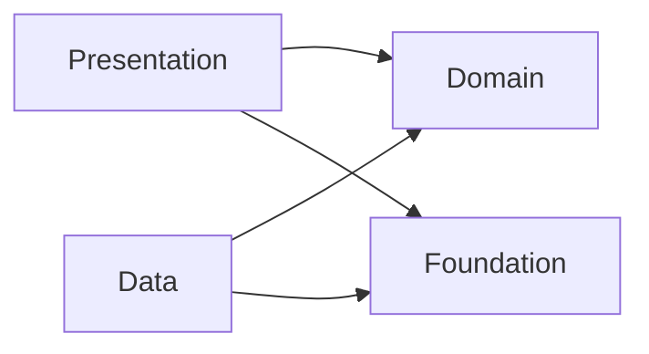

# Architecture

Repo này dùng Clean Architecture theo hướng tối giản, ưu tiên dễ hiểu nhưng vẫn tách bạch rõ ràng.

## Nguyên tắc chính

- Domain không phụ thuộc layer khác.
- Data phụ thuộc Domain, không phụ thuộc Presentation.
- Presentation chỉ phụ thuộc Domain (qua UseCase/Protocols).
- App là composition root, nơi wire dependency và khởi tạo flow.

## Dependency Rule (một chiều)

```
Presentation -> Domain <- Data
```

## Luồng dữ liệu điển hình

1. UI gọi UseCase (Domain).
2. UseCase gọi Repository Protocol (Domain).
3. Repository Impl (Data) thực thi, dùng Network/Database.
4. Mapper chuyển đổi DTO/Entity -> Domain Model.
5. Trả dữ liệu về UI.

## DI (Dependency Injection)

Base này dùng DI đơn giản để wire dependencies ở tầng `App`. Nếu dependency trở nên nhiều hoặc có trạng thái phức tạp, hãy tham khảo thư viện Factory của hmlongco:

[https://github.com/hmlongco/Factory](https://github.com/hmlongco/Factory)

## Tư duy module hóa

Hiện tại repo dùng cấu trúc theo layer. Khi mở rộng theo feature (hybrid slicing), mỗi feature có thể tự chứa đủ 3 layer:

```
Features/
  Home/
    Presentation/
    Data/
    Domain/
```

Với Domain, có 2 hướng:

- **Shared Domain**: gom domain dùng chung cho nhiều feature vào `Domain/` (centralized).
- **Feature Domain**: mỗi feature tự định nghĩa domain riêng trong `Features/<Feature>/Domain`.

Có thể kết hợp cả hai: domain dùng chung đặt ở `Domain/`, domain đặc thù đặt trong feature tương ứng.

## Sơ đồ tổng quan (Mermaid)



Giải thích:
- `Foundation` là core service dùng chung (logging, analytics, networking core, etc).
- `Domain` là trung tâm: model, usecase, protocol.
- `Data` là implement cụ thể (network, db, mapper).
- `Presentation` là UI + navigation.
- `App` là nơi lắp ghép dependency.

## Core Packages

Ba package core:

- `Router`: quản lý navigation (SwiftUI `NavigationStack`), route/destination, và luồng điều hướng.
- `RESTKit`: xử lý networking cơ bản (request builder, client, response handling).
- `Logger`: logging thống nhất cho app (levels, outputs).

Lý do tách 3 package:

- Dễ tái sử dụng giữa nhiều dự án.
- Chuẩn bị cho modularization về sau (có thể tách thành module/target riêng nếu cần).
- Giảm coupling giữa phần core và phần feature.

Mỗi package có README riêng. Khi cần cách dùng chi tiết, xem tại:

- [Router README](../iOSAppTemplate/Foundation/Navigation/Router/README.md)
- [RESTKit README](../iOSAppTemplate/Foundation/Networking/RESTKit/README.md)
- [Logger README](../iOSAppTemplate/Foundation/Logging/Logger/README.md)
